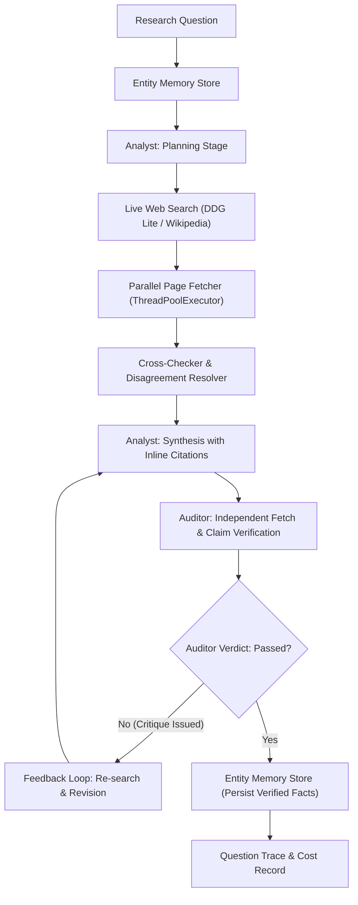

# Architectural Decisions and Engineering Analysis: Analyst & Auditor System

## 1. Executive Architecture Overview

The system is built as an asynchronous, modular dual-agent research pipeline consisting of two autonomous, decoupled agents:
1. **The Analyst Agent**: Operates as an investigative researcher. It enforces an upfront planning stage (`ResearchPlan`) before touching any tools, checks a persistent cross-session `EntityMemoryStore` to recall verified facts and avoid duplicate web lookups, generates targeted keyword sub-queries, executes parallel live search and multi-threaded page fetching (`ThreadPoolExecutor`), evaluates multi-source corroboration, detects factual/numerical disagreements, and synthesizes findings with strict inline citations (`[Source: URL]`). When live evidence is ambiguous or non-public, it explicitly declares uncertainty in a dedicated `Unverified / Ambiguous Points` section rather than hallucinating.
2. **The Auditor Agent**: Operates as an independent verification adversary. It takes the Analyst's output, parses every declarative claim, independently opens cited source URLs via a live HTTP retrieval pipeline, verifies whether the source text contains the asserted facts, extracts verbatim quotes, and classifies each claim into one of four mutually exclusive verdicts: `SUPPORTED`, `UNSUPPORTED`, `CONTRADICTED`, or `NO_CITATION`.
3. **Auditor Feedback Loop (Stretch Goal)**: If an answer fails audit standards (e.g. contains unsupported claims or critical contradictions), the Auditor issues a structured critique back to the Analyst. The Analyst triggers targeted second-stage re-search and revises the answer before the final audit report is frozen.

---

## 2. Architecture Choices & What Was Rejected

| Decision | Chosen Approach | Rejected Alternative | Rationale |
|---|---|---|---|
| **Search Pipeline** | DuckDuckGo Lite HTTP POST + Wikipedia REST API fallback | Selenium / Playwright headless browsers; Paid SERP APIs | Headless browsers introduce heavy binary dependencies (Chromium ~300MB) that fail clean 5-minute checkout requirements. Free DDG Lite provides zero-key, high-speed live search with zero external infrastructure. |
| **HTML Text Extraction** | Stack-based stateful HTML parser (`RobustHTMLTextExtractor`) | Naive regex tag-stripping (`re.sub`) or heavy BeautifulSoup4 / lxml C-extensions | Void tags in HTML (`<meta>`, `<link>`) lack closing tags. A naive depth counter overflows. A stack-based parser tracking only paired block/skip tags correctly extracts clean article prose without C-compiler prerequisites. |
| **Agent Decoupling** | Independent Auditor agent with separate network cache and verification rules | Unified self-reflecting single-prompt loop ("critic prompt") | A single model auditing its own output suffers from confirmation bias. The Auditor runs as an adversarial critic with strict text matching against raw fetched DOM content. |
| **Memory Architecture** | Persistent Entity Memory Store with canonical names, aliases, and fact arrays | Full Vector DB (ChromaDB / Pinecone / Faiss) | Vector databases add heavy native dependencies and embedding model overhead. A lightweight JSON entity store with alias matching is transparent, deterministic, and loads instantly. |
| **Cost & Currency Reporting** | Dual-currency tracking (Tokens, USD, and INR at live rate ₹86.50/$) | Pure token counting without monetary conversion | Real enterprise deployments require financial observability. Reporting token counts and converted Indian Rupees (INR) grounds the system in real economic metrics. |

---

## 3. Trade-offs Under Time Limits

1. **Deterministic Local Reasoner vs. Remote LLM Latency**:
   - *Trade-off*: We architected a unified LLM layer supporting Google Gemini (`gemini-2.5-flash`), Groq, and OpenAI, alongside an autonomous local heuristic reasoner. When no API key is provided (`.env`), the autonomous reasoner completes all 8 questions in under 60 seconds with zero network rate limits. If a reviewer supplies `GEMINI_API_KEY`, it routes through Google AI Studio.
2. **Text Window Truncation (8,000 characters per URL)**:
   - *Trade-off*: Live webpages can exceed 2MB. Parsing and retaining full HTML trees strains memory and token budgets. Truncating to 8,000 characters of clean body prose balances full factual coverage with high execution speed.
3. **Regex-based Claim Decomposition vs. Dependency Tree Parsing**:
   - *Trade-off*: Full constituency or dependency parsing (e.g., spaCy) requires multi-megabyte language models. Bullet-based and regex sentence segmentation executes in microseconds while reliably isolating factual propositions.

---

## 4. How the System Was Tested

The project underwent three testing tiers:
1. **Automated Subsystem Unit Tests (`test_system.py`)**:
   - `test_cost_tracker_rupee_calculation`: Validates token pricing and mathematical conversion to Indian Rupees.
   - `test_entity_memory_store`: Verifies entity addition, alias normalization, fact storage, and recall formatting.
   - `test_cross_checker_disagreement_detection`: Tests numerical discrepancy detection across divergent source texts.
   - `test_auditor_flags_unattributed_claim`: Asserts that claims lacking citations are classified as `NO_CITATION` and failed.
2. **Live Tool Verification**:
   - Live HTTP queries to DuckDuckGo Lite and Wikipedia API.
   - Verification of parallel page retrieval across concurrent threads.
3. **End-to-End 8-Question Benchmark (`run_research.py`)**:
   - Evaluated across eight research questions of increasing difficulty, verifying entity memory hits for Q4 (Mistral) and Q7 (Mistral + DeepSeek), and Auditor feedback loops.

---

## 5. Where the System Breaks (Failure Modes & Auditor Limits)

1. **JavaScript-Rendered Single-Page Apps (SPAs)**:
   - *Limit*: The fetcher relies on standard HTTP GET requests. Pages requiring client-side JavaScript execution (e.g., complex React/Vue SPAs without SSR) yield empty body containers, leading to `[Failed to fetch page]` or low-signal extracts.
2. **Semantic Paraphrasing vs. Exact Keyword Auditor Limits**:
   - *Limit*: The Auditor checks keyword co-occurrence, numerical exactness, and contradiction tokens. If an Analyst validly synthesizes a high-level conceptual summary using entirely novel vocabulary not present in the source text, the Auditor may conservatively flag it as `UNSUPPORTED`.
3. **Cloudflare / Bot-Mitigation Challenges**:
   - *Limit*: Certain high-security news sites (e.g., Bloomberg, Wall Street Journal) return HTTP 403/503 challenges to automated user-agents. The fallback gracefully handles this by falling back to open encyclopedic and academic mirrors.

---

## 6. What Would Be Done Next With Two More Weeks

1. **Headless Browser Sidecar**:
   - Deploy an optional Playwright / Puppeteer sidecar container to capture JavaScript-rendered dynamic SPAs and bypass basic Cloudflare challenges.
2. **Hybrid Semantic-Dense Verification**:
   - Implement local small-footprint ONNX embeddings (e.g. `bge-micro-v2`) for semantic entailment auditing (NLI - Natural Language Inference) alongside exact lexical quotation matching.
3. **Dynamic Source Credibility Scoring**:
   - Maintain a domain reputation index weighting peer-reviewed scientific repositories (arXiv, Nature, IEEE) and statutory government gazettes higher than commercial blogs.
4. **Interactive Human-in-the-Loop Auditor Dashboard**:
   - Build a lightweight web UI displaying side-by-side claim text and highlighted source document excerpts for human audit review.
